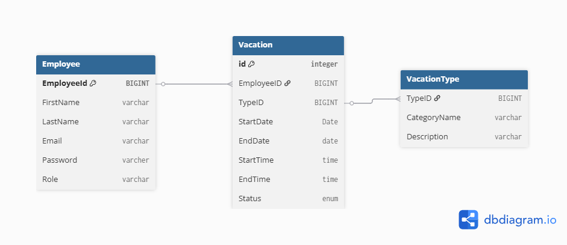
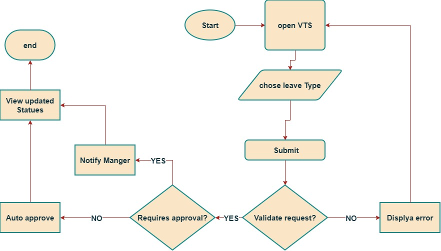

# Vacation Tracking System (VTS)

## Domain : 
- **Problem: In organization the process of requesting a vacation could take days.**
- **Solution: building a VTS that manages employee time-off requests, approvals, accruals, and balances to streamline HR processes.**

## Vision:
- **A vaction Tracking System (VTS) will provide employees with capablity to manage their own vacaition time, sick leave, and personal time off without having to be an expert in company policy or the local facility's leave policy.**

- **Goals:**
    - improve internal porcess of hte organization by reducing the amount of time to accept a vaction request. 
    - Give individual imployees the capability to mange their vacations.
    - Streamline the fuctions of (HR).
    - Minimize non-core business-related activites of management.
    - Give the sense of empowerment to employees.
    - System must be easy to use.


## Functional Requirements:
- Ruele based validation/verification of leave request.
- Optional manager approval.
- Access past year calender and 1.5 years in future.
- Email notifictions for approval/status change.
- Activity logs for all transactions
- HR/System admins override actions restricted by rules
- Logging for HR/System admins overries
- Managers award personal leave time (with system-set limits).
- Web service for other internal systems for vacation request summary

## Non-Functional Requirements:

- **Performance**: System must respond to user requests within 2 seconds under normal load.
- **Scalability**: Must support growth in number of employees and managers without degradation.
- **Availability**: System should be available 24/7 with minimal downtime.
- **Reliability**: Ensure accurate tracking of vacation balances and approvals without data loss.
- **Security**: Role-based access control (Employee, Manager, HR Clerk, Admin). Secure login required.
- **Usability**: Interface should be intuitive and easy to navigate for non-technical staff.
- **Portability**: System should run on multiple browsers and platforms without compatibility issues.
- **Auditability**: All transactions (requests, approvals, overrides) must be logged for review.


## Constraints:
- Uses existing hardware and middleware
- Is implemented as an extension to the existing intranet portal system.
- Uses the portal's single-sign-on mechanisms for all authentication.
- Interfaces with the HR department legacy systems to retrieve required employee information and changes.


## Actors and Their Roles

| **Actor**       | **Role / Responsibilities**                                                                 |
|------------------|---------------------------------------------------------------------------------------------|
| **Employee**     | Main user of the system. Manages their own vacation time (view, create, cancel requests).   |
| **Manager**      | Has all employee capabilities plus approves subordinates’ requests and can award comp time. |
| **Clerk**   | HR staff member. Maintains employee records, manages leave categories/locations, overrides rules. |
| **System Admin** | Ensures smooth operation of technical resources (web server, database), manages system logs. |


## sequence diagram:

---

## Entities:

---

## Flow Chart:



## sudo code: 
```
BEGIN VTS
  LOOP forever:
    open VTS system

    chooseLeaveType:
      display available leave types
      leaveType = getUserSelection()

    submit:
      startDate = getStartDate()
      endDate = getEndDate()
      request = createRequest(employeeId, leaveType, startDate, endDate)
      submitRequest(request)

    validateRequest:
      isValid = validate(request)

      IF isValid == FALSE THEN
        displayError()
        GOTO open VTS  

      IF isValid == TRUE THEN

        requiresApproval:
          needsApproval = checkIfRequiresApproval(leaveType)

          IF needsApproval == NO THEN
            autoApprove(request)
            updateStatus(request, "APPROVED")

          ELSE IF needsApproval == YES THEN
            notifyManager(request)
            waitForManagerDecision()

    viewUpdatedStatus:
      status = getRequestStatus(request)
      displayStatus(status) 

  END LOOP

END VTS
```
